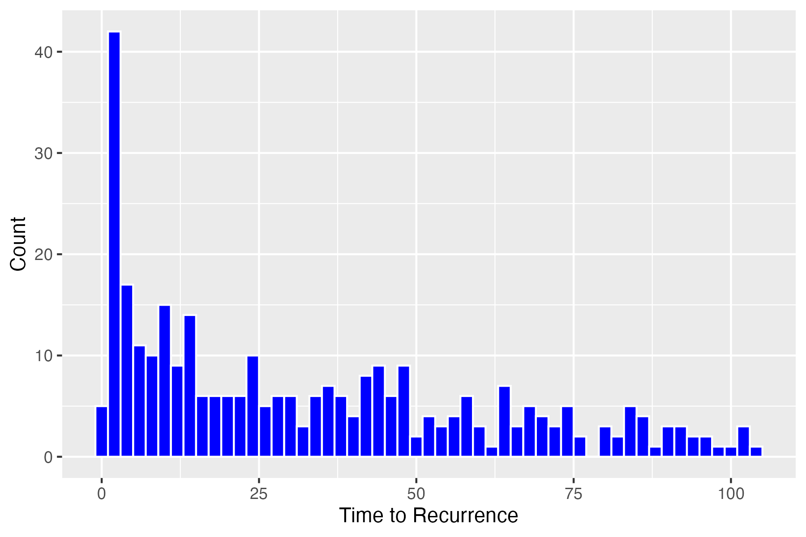

## Radical Prostatectomy Follow-Up Study
This data set contains 316 men who had undergone radical prostatectomy and received transfusion during or within 30 days of the surgical procedure and had available PSA follow-up data. The main exposure of interest was RBC storage duration group. A number of demographic, baseline and prognostic factors were also collected. The outcome was time to biochemical cancer recurrence. The dataset is cleaned and complete. There are no outliers or data problems. These are data from a study by Cata et al. “Blood Storage Duration and Biochemical Recurrence of Cancer after Radical Prostatectomy”. Mayo Clin Proc 2011; 86(2): 120-127.


```{r}
#| echo: false
#| label: tbl-one
#| tbl-cap: "Demographics, baseline and prognostic factors"
library(here)
here::i_am("Final Report.qmd")
table_one <- readRDS("output/table_one.rds")
table_one
median_pvol <- median(data$PVol, na.rm = TRUE)
median_pvol
```
@tbl-one shows the demographics, baseline, and prognostic factors of the study participants. The mean age of participants was `r gtsummary::inline_text(table_one, variable = "Age", column = "stat_0")` years old. The mean prostate volume was `r median_pvol`.

```{r}
#| echo: false
#| label: tbl-two
#| tbl-cap: "Time to Recurrence MLR" 
regression <- readRDS("output/regression_table.rds")
regression
```

@tbl-two displays the relationship between age, prostate volume and tumor volume with time to recurrence (in months).

```{r}
#| echo: false
#| label: tbl-three
#| tbl-cap: "Time to Recurrence Distribution"
library(knitr)

```

@tbl-three shows the distribution of time to biochemical cancer recurrence for all study participants. 
